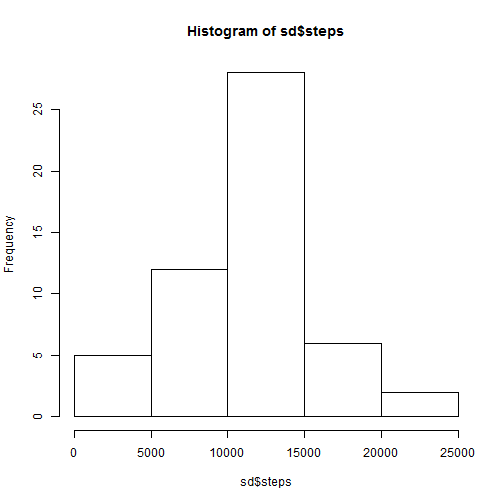
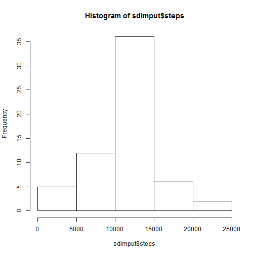
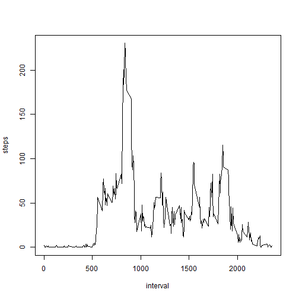
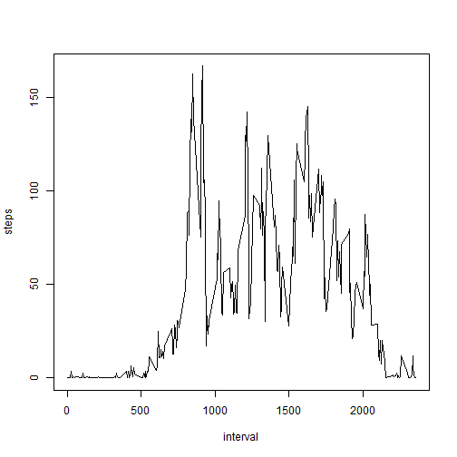

## Loading and preprocessing the data

1. Read data file


```r
act = read.csv('~/activity.csv')
```

## What is mean total number of steps taken per day?

1. Create dataset with number of steps per day without missing values, then plot the dataset in a histogram.


```r
sd <- aggregate(steps ~ date, data=act, FUN=sum)
hist(sd$steps)
```

 

2. Calculate mean and median steps per day.


```r
mean(sd$steps)
```

```
## [1] 10766.19
```

```r
median(sd$steps)
```

```
## [1] 10765
```

## What is the average daily activity pattern?

1. Create a dataset with average number of steps per time interval and plot as a time series interval x steps.


```r
actcomplete <- na.omit(act)
actavg <- aggregate(steps ~ interval, data=actcomplete, FUN=mean)
plot(actavg,type="l")
```

 

2. Find the observation with the maximum number of steps.


```r
maxsteps <- max(actavg$steps)
subset(actavg, actavg$steps==maxsteps)
```

```
##     interval    steps
## 104      835 206.1698
```

## Imputing missing values

1. Calculate the number of missing values


```r
length(act$steps[act$steps==NA])
```

```
## [1] 17568
```

2. and 3. Replace missing data with mean for that time interval, by adding the time interval averages to the original dataframe and replacing missing values with this average for each row.


```r
actmerged <- merge(act,actavg,by="interval")
index <- is.na(actmerged$steps.x)
actmerged$steps.x[index] <- actmerged$steps.y[index]
colnames(actmerged)[2]<-'steps'
actimput <- actmerged[,1:3]
```

4. Make a histogram similar to that without imputation and calculate mean and median.


```r
sdimput <- aggregate(steps ~ date, data=actimput, FUN=sum)
hist(sdimput$steps)
```

 

```r
mean(sdimput$steps)
```

```
## [1] 10766.19
```

```r
median(sdimput$steps)
```

```
## [1] 10766.19
```

The effects of imputation on mean and median are very small, but the histogram seems more skewed towards the mean.

## Are there differences in activity patterns between weekdays and weekends?

1. Create factor variable indicating if the date is a weekday or weekend day


```r
wkdy <- weekdays(as.Date(actimput$date), abbreviate=TRUE)
wkindex <- sapply(wkdy,function (x) if (x %in% c("za","zo")) "weekend" else "weekday")
actwk <- cbind(actimput,wkindex)
```

2. Plot similar time series to before with separate plots for weekend days and weekdays.


```r
actwkday <- actwk[which(actwk$wkindex=='weekday'), 1:3]
actwkend <- actwk[which(actwk$wkindex=='weekend'), 1:3]
actavgwkday <- aggregate(steps ~ interval, data=actwkday, FUN=mean)
actavgwkend <- aggregate(steps ~ interval, data=actwkend, FUN=mean)
plot(actavgwkday,type="l")
```

 

```r
plot(actavgwkend,type="l")
```

 

